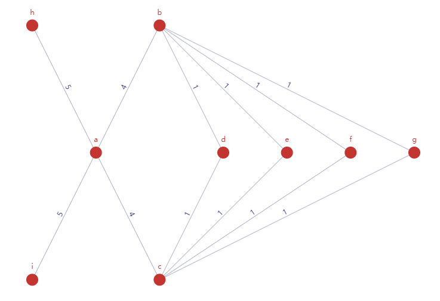

<h1>
    <center>Adaptive Backbone-based Routing in Delay Tolerant Networks</center>
    <center>Reproduction</center>
</h1>


## 一、论文基本内容

### 1. 基本思路

论文提出了一种路由方法(Adaptive Backbone-based routing)。这个方法首先设计了一个建模方法，该方法利用任意两个节点之间相遇的频次作为两节点相连边上的权重，以此来生成一个加权图。边上的权重可以用于表示节点之间的传输延迟。然后根据ANCC算法(Accumulated Node Coverage Condition)来得出一系列骨干节点，让这些骨干节点承担转发的任务。同时根据节点之间相遇的情况动态得更新节点的状态。

### 2. 定义的指标

#### 2.1 节点之间的传输延迟

在存在n个节点的网络中，每一个节点$u$有一个相遇频次($meeting frequency$)，代表了它与另一个节点$v$的相遇次数$f_{uv},(f_{uv}\in[0,+\infty])$，那么两个节点之间的延迟就是：
$$
E(l_{uv})=\frac{1}{f_{uv}}
$$
另外，当$f_{uv}=+\infty$时，$E(l_{uv}=0)$。实际上可以综合考虑交互时间等其他因素完善边上的权重的意义，从而达到更好的效果，论文中仅考虑相遇频次。

#### 2.2 路径上的传输延迟

存在一条路径$R = a_1,a_2,...,a_m$，那么这条路径上从第一个节点到最后一个节点的传输延迟是所有中间节点传输的延迟之和：
$$
E(l_R)=\Sigma^{m-1}_{i=1}\frac{1}{f_{i(i+1)}}
$$

#### 2.3 相遇频次阈值

当节点之间的相遇频次达到阈值$f_{thres}$后，才在节点之间连上一条边。更大的阈值可以减少整个图的复杂度，从而减少模拟运行的时间；更小的阈值可以增加整个图的复杂度，从而使得一组骨干节点更加容易找到。

### 3. Network Backbone

#### 3.1 定义

骨干节点是生成的加权图中，与其他节点相遇最频繁的节点，它们拥有很大的度以及与它们相连边的权重。在此模型中，只有骨干节点可以转发消息，非骨干节点只有在其是一条消息的源发送节点时才能发送消息。另外，骨干节点转发消息不是以一种广播的方式，当它的邻居节点是骨干节点且邻居节点没有收到过这一消息才会向邻居节点转发，从而减小网络的负担。

#### 3.2 效果

1. Efficiency，生成的骨干节点集应该比较小，使得消息在网络中传播的规模较小。
2. Effectiveness，虽然模型中只有一部分节点转发消息，但是期望端到端的延时不受影响。

### 4. The Delay Tolerant Connected Dominating Set(DTCDS)

#### 4.1 定义 

*Given a DTN, a weighted graph $G = (V,E,w)$ is derived, with $V$ being the mobile node set, $E$ being edges between any two nodes when their meeting frequency is greater than $0$, and $w(u, v) = f_{uv}$ being the weight function. Consider a subset of nodes $V' \subseteq V$ , and $E'= \{(u,v)|u,v \in V',(u, v) \in E\}$, such that*

​	*1) $(V',E')$ is connected, and*

​	*2) $\forall v,v\notin V',\ \exists u,u\in V',\ f_{uv}>0$.*

即根据加权图选出的节点必是互相连通的且至少连接一个未被选出的节点。

#### 4.2 最小等效DTCDS

*The minimum equally effective DTCDS of a given weighted graph is the one that* 

​	*1)  has the smallest number of selected nodes $|V'|$, and* 

​	*2)  $\forall v,u$, the expected delivery latency between them via $G'=(V',E')$ is the same with that via $G = (V,E)$.*

#### 4.3 定理1

*Theorem 1: The minimum equally effective DTCDS contains all intermediate nodes on shortest paths of the graph.*

也就是说，对于任意一个节点$w$，如果它在某两个节点的最短路径上，那么$w$就应该被包含在骨干节点中。

### 5. 一个局部启发式算法

#### 5.1 Accumulated Delivery Latency

*Assume that there are d node disjoint paths connecting node $u$ and $v$, $R_i$, with expected path delivery latencies of $E(l_{R_1}, E(l_{R_2}),...,E(l_{R_d})$. Then the accumulated delivery latency between u and v via these paths is*
$$
E(L_{uv})=1/\Sigma^{d}_{i=1}\frac{1}{E(l_{R-i})}
$$


即，两个节点经过不同路径的相遇频次可以叠加，从而减少延迟。

#### 5.2 The Accumulated Node Coverage Condition

*Node $v$ is unmarked if, for any two neighbors of $v$, $u$ and $w$, a group of replacement paths, $R_1, R_2,...,R_t$, exists connecting $u$ to $w$ such that* 

​	*1) each intermediate node (if there is any) on any replacement path $R_i,(i = 1,...,t)$ has a higher priority than $v$, and* 

​	*2) the accumulated delivery latency of the group of replacement paths is smaller than or equal to the delivery latency of path $u, v, w$. That is*
$$
E(L{uw})\le E(l_R)=\frac{1}{f_{uv}}+\frac{1}{f_{vw}}
$$
即，对于节点$v$及其两个邻居$u,w$，存在一组$u$和$w$之间路径，该组路径中的中间节点优先级高于$v$，且根据累积延时计算出的延时小于$v$所在路径的延时，那么$v$就不是骨干节点。

#### 5.3 算法1 ANCC algorithm

[1.] Each node sets up the meeting frequency for each neighbor by recording its having met with them, and exchanges this information with neighbors. 

[2.] Each node determines its status (marked/unmarked) using the accumulated node coverage condition.

#### 5.4 定理3

Theorem 3: Routing with only marked nodes by the ANCC algorithm forwarding has the same performance as routing with all nodes forwarding in terms of message delay.

论文中证明了，通过ANCC算法标记出的节点转发消息能够达到和Epidemic算法一样的性能。其证明可概括为：当使用Epidemic算法时，消息一定是通过最短路径到达目的节点的，而ANCC算法则找出了最短路径，通过最短路径转发。


## 二、实现方法

搜寻当前节点的任意两个邻居之间的最短路径，如果最短路径中包含当前节点则其为骨干节点。

### 1. 路由协议的属性

```java
/** 更新节点状态的阈值 */
public static final double F_INIT = 2;

/** 连接频次 */
public Map<DTNHost, Integer> freq;

/** 是否被标记为骨干节点*/
public boolean marked = true;

/** 预运行一小段时间，使得各节点之间的相遇频次达到一定的阈值，作为生成骨干节点的信息*/
public int warmTime = 0;
```

### 2. 重写changedConnection()函数

```java
    @Override
    public void changedConnection(Connection con){
        super.changedConnection(con);

        if(con.isUp()){
            DTNHost otherHost = con.getOtherNode(getHost());
            // 更新两节点之间的相遇频次
            updateMeetFreq(otherHost);
            if(warmTime > F_INIT){
            // 达到阈值，更新骨干状态
                updateBackboneStatus(otherHost);
//                updateBackboneStatus2(otherHost);
            }
            warmTime++;
        }
    }

    /**
     * 更新相遇频次，相遇次数+1
     * @param host 相遇的节点
     */
    private void updateMeetFreq(DTNHost host){
        int oldFreq = getFreq(host);
        int newFreq = oldFreq + 1;
        freq.put(host, newFreq);
    }

    /**
     * 更新当前节点a的骨干状态，遍历与其相连的所有节点，
     * 计算每一对邻居之间的最短路径(即相遇频次最高路径)，
     * 如果存在一对邻居最短路径包含a，那么a被置为骨干，否则a不是骨干
     * @param host 相遇节点
     */
    private void updateBackboneStatus(DTNHost host){
        boolean flag = false;
        for(Map.Entry<DTNHost, Integer> e : freq.entrySet()){
            // 如果最短路径包含当前节点，则将其置为骨干节点
            if(e.getKey().equals(host)) continue;
            List<DTNHost> path = getShortestPath(host, e.getKey());

            if(path.contains(getHost())){
                flag = true;
            }
        }
        if(flag) marked = true;
        else marked = false;
    }
```

### 3. ANCC算法
对于当前节点及其两个邻居，存在一组邻居之间的路径，根据累积延时计算出的延时小于当前节点所在路径的延时，那么当前节点就不是骨干节点。
```java
    private void updateBackboneStatus2(DTNHost host){
        // 累计频次
        double AccumulatedFreq = 0;
        // 累计延迟
        double AccumulatedDelay = 0;
        // 对于本节点的任意两个邻居，它们之间的累计延迟都要小于等于包含本节点的路径的延时，才能将本节点置为非骨干节点，否则它就是骨干
        boolean flag = true;
        // 一重循环，选定本节点的非当前连接节点的邻居，即非host的邻居，通过host在2跳内找到该邻居
        for (Map.Entry<DTNHost, Integer> selfEntry : freq.entrySet()){
            AccumulatedFreq = 0;
            DTNHost h1 = selfEntry.getKey();
            if(h1.equals(host)) continue;
            MessageRouter hostRouter = host.getRouter();
            assert hostRouter instanceof AdaptiveBackboneRouter : "error";
            Map<DTNHost, Integer> hostFreq = ((AdaptiveBackboneRouter)hostRouter).freq;
            // 二重循环，选中host的任意相连节点，即第1跳节点
            for(Map.Entry<DTNHost, Integer> hostEntry : hostFreq.entrySet()){
                DTNHost h2 = hostEntry.getKey();
                if(h2.equals(getHost())) continue;
                // 选中的节点是要找的邻居，计算累积频次
                if(h2.equals(h1)){
                    AccumulatedFreq += (double) hostEntry.getValue();
                    continue;
                }
                MessageRouter r = h2.getRouter();
                assert r instanceof AdaptiveBackboneRouter : "error";
                Map<DTNHost, Integer> f = ((AdaptiveBackboneRouter)r).freq;
                // 三重循环，选中host相连节点的相连节点，即第2跳节点
                for(Map.Entry<DTNHost, Integer> e : f.entrySet()) {
                    DTNHost h3 = e.getKey();
                    if (h3.equals(getHost()) || h3.equals(host)) continue;
                    // 选中的节点是要找的邻居，计算累积频次
                    if (h3.equals(h1)) {
                        AccumulatedFreq += 1.0 / (1.0 / hostEntry.getValue() + 1.0 / e.getValue());
                    }
                }
            }
            // 计算累积延迟
            AccumulatedDelay = 1.0/AccumulatedFreq;
            // 计算本节点所在路径的延迟
            double OriginDelay = 1.0/freq.get(h1) + 1.0/freq.get(host);
            // 如果存在累积延迟大于原始延迟，则寻找失败，本节点不能被标记为非骨干
            if(AccumulatedDelay > OriginDelay){
                flag = false;
                break;
            }
        }
        marked = !flag;
    }

```


### 4. 求最短路径算法

利用Dijkstra算法求from到to的最短路径

```java
    /**
     * 获取两个节点之间的最短路径
     * @param from 起始节点
     * @param to 目标节点
     * @return 最短路径列表
     */
    private List<DTNHost> getShortestPath(DTNHost from, DTNHost to){
        List<DTNHost> path = new ArrayList<DTNHost>();
        // 某节点与from节点之间的距离，根据搜寻的路径动态变化
        Map<DTNHost, Double> delay = new HashMap<DTNHost, Double>();
        // 已搜寻过的节点集合
        Set<DTNHost> visited = new HashSet<DTNHost>();
        // 一个方法内部类，用于优先队列内部元素的比较，即根据该节点到from节点之间的距离比较
        class DelayComparator implements Comparator<DTNHost>{

            @Override
            public int compare(DTNHost o1, DTNHost o2) {
                double delay1 = delay.get(o1);
                double delay2 = delay.get(o2);
                if(delay1 > delay2){
                    return 1;
                }
                else if(delay1 < delay2){
                    return -1;
                }
                else {
                    return 0;
                }
            }
        }
        Queue<DTNHost> unvisited = new PriorityQueue<DTNHost>(30, new DelayComparator());
        // 搜寻过的节点及其前继节点的映射
        Map<DTNHost, DTNHost> prevHops = new HashMap<DTNHost, DTNHost>();
        /** 初始化，将from放入以搜寻过的队列，距离设为0*/
        delay.put(from, (double) 0);
        unvisited.add(from);

        if(from.equals(to)){
            return path;
        }
        DTNHost host;
        while ((host = unvisited.poll()) != null){
            // 从未搜寻的队列中取出离from最近的节点
            if(host.equals(to)){
                break;
            }

            visited.add(host);

            // 更改host的邻居到from节点的距离，并将邻居加入到unvisited队列参与寻找最短路径
            MessageRouter hostRouter = host.getRouter();
            assert hostRouter instanceof AdaptiveBackboneRouter : "自适应骨干路由只适用于相同的路由协议";
            Map<DTNHost, Integer> hostFreq = ((AdaptiveBackboneRouter)hostRouter).freq;
            // 通过host所能到达的节点
            DTNHost partialTo;
            // 根据host与from的delay计算出的host所能到达的节点与from的delay
            double delayTo;
            for(Map.Entry<DTNHost, Integer> e : hostFreq.entrySet()){
                partialTo = e.getKey();
                if(visited.contains(partialTo)){
                    continue;
                }
                delayTo = delay.get(host) + 1.0/e.getValue();
                // 如果更新后的delay小于原来其与from的delay，则更新该节点的前继节点和delay
                if(delayTo < delay.getOrDefault(partialTo, (double) 1000)){
                    prevHops.put(partialTo, host);
                    unvisited.remove(partialTo);
                    delay.put(partialTo, delayTo);
                     unvisited.add(partialTo);
                }
            }
        }
        // 根据目的节点的前继节点逐个回溯，得到路径
        if(host != null){
            DTNHost prev = prevHops.get(to);
            path.add(0, host);
            while (!prev.equals(from)){
                path.add(0, prev);
                prev = prevHops.get(prev);
            }
            path.add(0, prev);
        }
        return path;
    }
```

### 5. 重写update()函数

重写update()函数，在更新时，向目标节点以及骨干节点发送消息

```java
    @Override
    public void update() {
        super.update();
        if(!canStartTransfer() || isTransferring())
            return;
        
        // 如果消息下一跳的节点遇到的节点就是目标节点，则转发，该消息发送完成
        if(exchangeDeliverableMessages() != null)
            return;
        
        // 向骨干节点发送其他消息
        tryOtherMessages();
    }

    private Tuple<Message, Connection> tryOtherMessages(){
        List<Tuple<Message, Connection>> messages = new ArrayList<Tuple<Message, Connection>>();

        Collection<Message> msgCollection = getMessageCollection();

		/* 当所连接的节点是骨干节点是就发送消息 */
        for (Connection con : getConnections()) {
            DTNHost other = con.getOtherNode(getHost());
            AdaptiveBackboneRouter othRouter = (AdaptiveBackboneRouter)other.getRouter();

            if (othRouter.isTransferring()) {
                continue; // 跳过正在发送消息的节点
            }

            for (Message m : msgCollection) {
                if (othRouter.hasMessage(m.getId())) {
                    continue; // 该节点已获得该消息，不再转发
                }
                if (othRouter.marked) {
                    // 其他节点是骨干节点就转发
                    messages.add(new Tuple<Message, Connection>(m,con));
                }
            }
        }

        if (messages.size() == 0) {
            return null;
        }
        // 发送刚才生成的消息队列给对应节点
        return tryMessagesForConnected(messages);
    }
```


## 三、仿真结果
### 1. 仿真场景

| 场景   | 场景1 | 场景2 | 场景3 | 场景4 | 场景5 | 场景6 |
| ------ | ----- | ----- | ----- | ----- | ----- | ----- |
| people | 40    | 40    | 40    | 60    | 80    | 80    |
| cars   | 10    | 10    | 20    | 30    | 40    | 40    |
| trams  | 0     | 3     | 6     | 9     | 6     | 0     |
| buses  | 0     | 0     | 0     | 0     | 0     | 5     |
| 总和   | 50    | 53    | 66    | 99    | 126   | 125   |

### 2. 节点关系图
[节点关系图](http://rocksugar.work/iot/NodeNetWork.html)

### 3. 消息送达率
[送达率对比图](http://rocksugar.work/iot/DeliveryProbability.html)

### 4. 平均延时
[平均演示对比图](http://rocksugar.work/iot/Latency.html)

### 5. 网络负载
[网络负载对比图](http://rocksugar.work/iot/OverheadRatio.html)


## 四、不足与改进

### 1. 问题

1. 论文中所采用的骨干节点模型并不适用于所有场景，在某个场景中，节点的运动十分活跃就很难生成DTCDS，或者说很多的节点都成为了骨干节点，模型退化成了Epidemic算法。
2. 在一个运动频繁的场景中，加权图中的节点的度会非常大，导致运行的效率降低
3. 当生成的加权图十分复杂时，只利用ANCC算法就不能生成骨干节点，例如：

    

    在上图中，根据公式$E(L{uw})\le E(l_R)=\frac{1}{f_{uv}}+\frac{1}{f_{vw}}$

    $$
    \begin{align}
        E(L_{bc})&=1/(\frac{1}{E(L_{R1})}+\frac{1}{E(L_{R2})}+\frac{1}{E(L_{R3})}+\frac{1}{E(L_{R4})})\\
            &=1/(\frac{1}{\frac{1}{f_{bd}}+\frac{1}{f_{dc}}} + \frac{1}{\frac{1}{f_{be}}+\frac{1}{f_{ec}}} + \frac{1}{\frac{1}{f_{bf}}+\frac{1}{f_{fc}}} + \frac{1}{\frac{1}{f_{bg}}+\frac{1}{f_{gc}}})\\
            &=1/(\frac{1}{2} + \frac{1}{2} + \frac{1}{2} + \frac{1}{2})\\
            &=\frac{1}{2}\\
        E(L_R)&=\frac{1}{f_{ba}} + \frac{1}{f_{ac}}\\
            &=\frac{1}{2}
    \end{align}
    $$
    所以有$E(L{bc})\le E(l_R)$，则a被排除。

4. 论文中提出的模型，并未考虑时间维度上的变化，可能某两个节点在一段时间内联系密切，使得其中的节点成为了骨干节点，而一段时间后两节点联系停止，该骨干节点仍然拥有骨干地位，需要较长时间才能退化为普通节点。

### 2. 改进

1. 在算法中加入类似Prophet算法中随着时间能够变化的权值，当节点的状态一段时间未发生变化则增加它与其他节点的距离，从而加入时间对节点地位的影响。